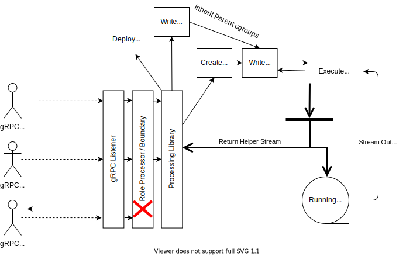
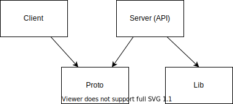

# Design Document

## Expected Process Flow



## Worker Library

This library will be responsible for encapsulating the necessary syscalls for
isolation and deployment of (and attachment to) cgroups for resource control.
The library will also embed a helper binary for running subprocesses.

When a client executes a start request, the library will generate a random ID
and create cgroup folders for that ID under the parent PID. The cgroup files
will then be updated with the resource constraints, and the helper process PID
will be written to the cgroups.

The helper on initialization will create a set of cgroups in the
/sys/fs/proc/*/parentID/uniqueID/ directories. These would initially inherit the
cgroups of the parent process which would be the default cgroups (primarily
created to help manage the cgroup folders for sub-processes). After the cgroup
creation the helper process will override the specific cgroup parameters
indicated in the design with the hard-coded values. Then the helper will write
its own PID into the tasks file of each cgroup (adding itself to the cgroups).
After that it will create the sub-process `*exec.Cmd`, while passing the syscall
flags for isolation and mapping the os.Stdin, os.Stdout, and os.Stderr to the
sub-process `*exec.Cmd` corresponding fields.

Random ID generation will use `crypto/rand` like this:

```go
id, _ := rand.Int(rand.Reader, big.NewInt(10000))
```

`crypto/rand` is used to ensure enough entropy so that there are not overlapping
IDs. Usually I would use a UUID, but I believe the smaller number here will make
it easier to test for the exercise.

### cgroup Configuration

- `notify_on_release` in `pids` to clean up the cgroup folder on exit
- `memory.limit_in_bytes` set to `209715200` (200MB)
- `cpu.cfs_quota_us` set to `10000` (10ms or 1/10 of the default 100ms set in
  `cpu.cfs_period_us`)
- `blkio.throttle.write_bps_device` set to `8:0 10485760` (10MB/s for primary
  disk)

### syscall Configuration

- `syscall.CLONE_NEWUTS` for hostname and NIS domain name isolation
- `syscall.CLONE_NEWPID` for process isolation
- `syscall.CLONE_NEWNS` for mounting isolation
- `syscall.CLONE_NEWNET` for network isolation

**NOTE:** I am not configuring network connections for sub-processes in the
exercise. No commands will have network access.

#### About Isolation in the Linux Kernel

Isolation flags tell the kernel to isolate the process into different
namespaces, restricting the resources visible to the process.

NEWUTS sets up the process with a hostname namespace. Initially it will match
the parent process, but it can be changed once isolated without affecting the
parent process.

NEWPID isolates the process IDs so that they start over again without having
visibility into any processes executing outside the namespace.

NEWNS sets up the mount namespace and isolates mounting so that files can be
mounted and unmounted without affecting the rest of the system. Initially a
mount namespace will share the same mounts as the parent process, but those
mounts can then be changed without affecting the parent process.

NEWNET isolates the networking. The settings I'm using here will completely cut
off all network access to the processes with the exception of the loopback. The
networking can be re-connected by creating virtual eth devices but I wasn't
planning on doing that in this exercise.

One thing I'm not doing that could be more of a risk in a production environment
where true isolation is desired is changing the root directory of a process.
Remapping the root directory is important for proper isolation because it
removes any views of the parent OS from the child process. I have chosen not to
do that for this exercise so each process will have full $PATH access. If I were
to change the root it would be necessary to provide a set of root directories
(for example the filesystem for a linux distro like alpine) or create custom
mounts to the host os.

I'm also not isolating the users as part of these syscalls which would hide the
user and group spaces so that none of the users and groups outside the namespace
are visible. There are other namespaces I am not taking advantage of which
further isolates a process from the host OS.

### Helper Binary

This helper binary will be responsible for running the subprocess in isolation
and for controlling the subprocess's resources. This helper binary will utilize
environment variables to configure the resource limits and will passthrough the
command and arguments to the subprocess.

### Exported API

The API will be simple, abstracting away the complicated details of isolation
and resource constraints. Each Box instance can have any number of isolated
processes with their own resource limits.

```go
package sandbox

// New returns a sandbox environment after creating the parent
// cgroups which manages the processes within the library.
func New(context.Context) Box

// Box manages an internal collection of processes and resources.
// Each instance of Box has its own isolated cgroup and is
// responsible for creating subprocesses using the helper binary.
type Box struct {
    // ... Unexported Fields
}

// Start executes the commands in the sandbox environment.
func (b *Box) Start(cmd string, args...string) (id int, err error)

// Stop will cancel the child context used to call the helper binary,
// the helper binary will monitor for sigterm and will cancel the
// subprocess context.
func (b *Box) Stop(id int) error

// Stat returns the status of the process with the given id.
func (b *Box) Stat(id int) (Status, error)

// Output returns a io.ReadCloser instance for reading the
// output of the process for the given id.
func (b *Box) Output(id int) (io.ReadCloser, error)

// Cleanup will remove the sandbox temp directory
// and all of its contents.
func (b *Box) Cleanup()

// Status indicates the current status of the process and if
// the process has exited the exit code will be included
type Status struct {
 Exited bool
 Code   int
}
```

**TRADEOFF:** For simplicity I have chosen to merge the stdout and stderr into a
single stream as the "output" of the command. This is not ideal for a production
instance as it doesn't allow for differentiation between the two streams.

**TRADEOFF:** In an effort to preserve the existing system `$PATH` execution
environment I have chosen not to remap the root of the isolated process. This
will allow the client to have full access to the binaries on the system for
execution.

**TRADEOFF:** Usually when developing a library it is preferred that the user is
able supply configurations such as resource control and network isolation
values. This implementation will hard code these values in the library itself to
simplify the API for the client.

**TRADEOFF:** In general, unbounded parallelism is not a good idea, but, with
the limited (non-production) scope, I have chosen to use the `go` primitive
without protections. This is less of a concern for this design due to the
resource control of the implementation.

### Testing

Library testing will utilize several test binaries. The testing will be minimal
to account for time. The helper process will be tested to ensure proper
propagation of the environment variables and stdin/stdout/stderr.

## API

The API is responsible for accepting a command and arguments, and executing the
specific method action in the library. For example, a call to the `Start`
endpoint will start a new isolated and constrained instance of the command
(using the library) with the provided arguments.

The `protobuf` definition for the gRPC service and the messages are located in
the [proto/api.proto](../proto/api.proto) file.

### API CLI

The API will execute as a CLI process. The CLI will accept configuration
information for hosting the gRPC service such as the host:port, certificate, and
private key.

**NOTE:** The initial set of certificates will be stored in the git repository.
This is *very* insecure and should **NEVER** be done.

```bash
# Example CLI Usage
server -host=localhost -port=8080 -cert=server.cert -key=server.key
```

### Available gRPC Commands

- `Start`: Start a new isolated process with the provided command and arguments
- `Stop`: Stop the process with the provided ID
- `Stat`: Return the process state of the process with the provided ID
- `Output`: Stream the output of the process with the provided ID

### Streaming Output

The library will propagate the output of the command to the API as an
io.ReaderAt. The io.ReaderAt documentation specifically states it should be
implemented for parallel safe reads. The `*os.File` type implements the
`io.ReaderAt` interface. Each caller requesting a `io.ReaderAt` instance will
maintain it's own cursor position. This allows different callers to read from
the begining of the output stream.

### Third Party Libraries

Requirements of the exercise require the following third party libraries. These
will likely be the only libraries required for the implementation. If the need
for additional libraries arises, I will confer with the team to determine if
these libraries are required.

- [google.golang.org/protobuf](https://pkg.go.dev/mod/google.golang.org/protobuf)
- [google.golang.org/grpc](https://pkg.go.dev/mod/google.golang.org/grpc)

### Transport Security

**NOTE:** CA and Private Key certificates will be embedded in this repository
for the purposes of the exercise. This is bad practice and a serious security
risk.

### Authentication

Authentication will use mTLS (TLS 1.3) as defined in the requirements. The
cipher suite will follow recommendations from [SSL Labs](https://github.com/ssllabs/research/wiki/SSL-and-TLS-Deployment-Best-Practices#23-use-secure-cipher-suites).

Here is an example TLS configuration for TLS 1.3. Go's default cipher suites
will be used as they are secure and compliant.

```go
config := &tls.Config{
  MinVersion:               tls.VersionTLS13, // TLS 1.3
  RootCAs:                  caCertPool,
  ClientCAs:                caCertPool,
  ClientAuth:               tls.RequireAndVerifyClientCert,
  Certificates:             []tls.Certificate{cert},
  PreferServerCipherSuites: true, // Prefer server cipher suites
 }
```

Originally I intended to use TLS 1.2 as my minimum version but there is no
reason not to use TLS 1.3 as my minimum version. Obviously, in a production
environment, this may not be possible due to legacy 1.2 support.

TLS 1.3 is faster and more secure so it makes sense as a minimum version for a
new system.

#### Certification Creation

I will use a helper binary to create the certificates. This will be used to
create the CA certificate and the client certificates. It will be hard-coded
with a set of certificates for testing, including different organizations and
units.

>Certificates will be RSA keys with a 4096 bit key length.

Here is an example of a certificate setup:

```go
cert := &x509.Certificate{
   SerialNumber:    serial,
   Subject:         pkix.Name{
                      Organization: []string{"it"},
                      OrganizationalUnit: []string{
                      "admin",
                      "superadmin",
                      },
                      Country:       []string{"US"},
                      Province:      []string{"Raleigh"},
                      Locality:      []string{"North Carolina"},
                      StreetAddress: []string{""},
                      PostalCode:    []string{""},
                    },
   IPAddresses:     []net.IP{net.IPv4(127, 0, 0, 1), net.IPv6loopback},
   NotBefore:       time.Now(),
   NotAfter:        time.Now().AddDate(10, 0, 0),
   SubjectKeyId:    []byte{1, 2, 3, 4, 6},
   ExtKeyUsage:     []x509.ExtKeyUsage{
                      x509.ExtKeyUsageClientAuth,
                      x509.ExtKeyUsageServerAuth,
                    },
   KeyUsage:        x509.KeyUsageDigitalSignature,
  }
```

#### Certificate Naming Convention

The server certificate will be named simply `server.cert/key`. The CA
certificates will be named `ca.cert/key`.

To simplify certificate identification for the client CLI, the certificates will
be named with the following convention:

  `<org1-org2-orgN>_<unit1-unit2-unitN>.key/cert`

`key` == private key
`cert` == public key

This naming convention will help with knowing which certificates are authorized
for which commands as is detailed in the [Authorization](#authorization)
section.

### Authorization

Client authorization will use information embedded into the certificate. The
information I will use in this exercise are the Organization and
OrganizationUnit fields which will map to hard coded allowed commands in the
API. The exception to this role system will be the `admin` role which will have
access to all commands.

Key information will be accessed through the `context.Context` object propagated
by the gRPC server.

#### Example of getting TLS information from the context

```go
p, ok := peer.FromContext(ctx)
if ok {
tlsInfo := p.AuthInfo.(credentials.TLSInfo)
 // Do something with tlsinfo here
}
```

### Role Scheme

This scheme will be enforced by an *allow-list* of commands hard-coded into the
API via types like this:

```go
type Role map[string][]string // Role[unit] = []string{allowed_command}
type Roles map[string]Role // Roles[org] = Role
```

**NOTE:** In a real-world scenario, this would be a more complex authorization
scheme. For the purposes of this exercise, we will use a simple authorization
scheme as defined in the requirements.

### Hard Coded Roles for the Exercise

|  Role | Commands |
|-------|----------|
| `it`: `admin` |  ALL Commands |
| `it`: `user` | `ls`, `ps`, `cat`, `whoami`, `pwd` |
| `hr`: `user` | `whoami`, `ls` |

## Client

The client will be a simple CLI application that will interact with the API over
gRPC. The commands will simply follow the same pattern as the API with flags for
host:port, certificate, and private key. Following the flags, the client will
provide the command and arguments to be executed.

**NOTE:** The initial set of certificates will be stored in the git repository.
This is *very* insecure and should **NEVER** be done.

```bash
# gRPC url config will be provided via environment variable for the exercise
# to simplify the CLI.
export GRCP_CONN=127.0.0.1:50000

# Path to the certificate directory
export CERTPATH=./certs

# Certificate prefix of the user to assume the role of
export ASSUME=it-admin

# Path to the certificate directory
export CERTPATH=./certs

# Certificate prefix of the user to assume the role of
export ASSUME=it-admin

# Example CLI Usage (Start)
client start command arg1 arg2 ...

# Example CLI Usage (Stop)
client stop 11982123 # example process id

# Example CLI Usage (Stat)
client stat 11982123 # example process id

# Example CLI Usage (Output)
client output 11982123 # example process id
```

**NOTE:** There will be minimal validation of the command and arguments. The
user is expected to correctly execute the command. This is not how I would write
this for production.

## Reproducible Builds and CI/CD

Package management for this application will use go modules to ensure that the
build it reproducible. Execution of the `go mod init <module_name>` command will
create a go.mod file that will be used to manage the dependencies of the
application. For public repositories the `sum.golang.org` is used to ensure that
the checksum values are correct. The values returned from `sum.golang.org` are
stored in the `go.sum` file. To use a different checksum service, simply change
`GOSUMDB` to point at the desired service.

**NOTE:** For the purposes of this exercise, I will use the `sum.golang.org` and
all dependencies will be public. The keeps me from having to setup `GOPRIVATE`
and adding `insteadOf` configs for `git`.

### Developer Environment Validation

To ensure that builds are valid, tests are passing and linting passes prior to a
push to Github the `pre-commit` framework will execute with the settings located
in the `.pre-commit-config.yaml` file. These pre-commit hooks also check for
embedded secrets.

**NOTE:** There will be embedded secrets added to this repo and the
detect-secrets baseline will be reset to account for those.

### CI/CD

A suite of Github actions will be included to verify builds and tests are
passing for the different elements of the exercise. For the server and library
the actions will be limited to running on a linux environment due to the need to
access Linux only syscalls and features. For the client, the actions will run a
matrix of different operating systems.

## Dependency Structure

To ensure proper separation of concerns (and eliminate cyclical dependencies)
the internal dependency structure will follow the approach below. Arrows
indicate dependency direction.



## Additional Unsupported Features

- No Shell / REPL Support
- The Client will be limited to single connections ONLY
- Hard Coded and Embedded Secrets
- Limited to single running instances of a command
- No included build tags (to limit os support)

---

## Additional Notes


